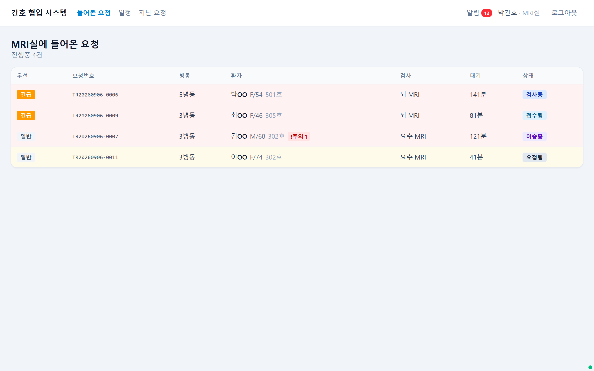
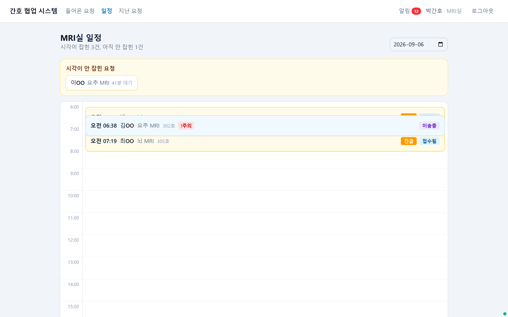
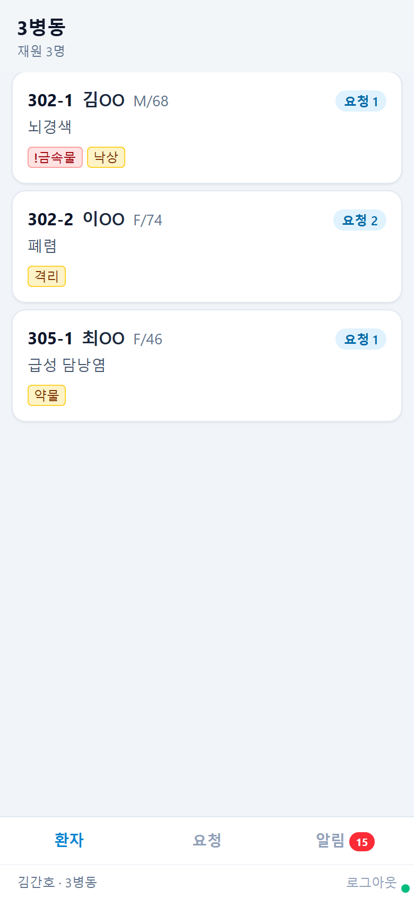
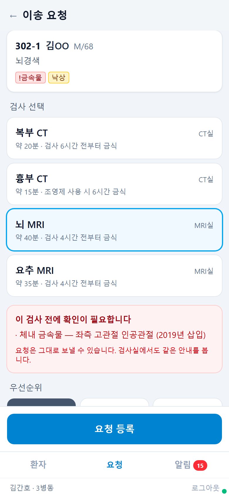
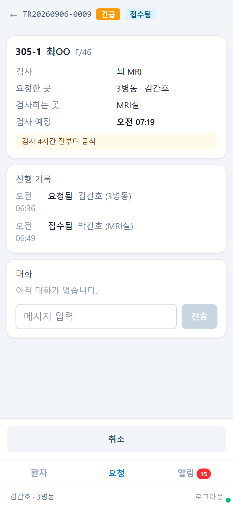
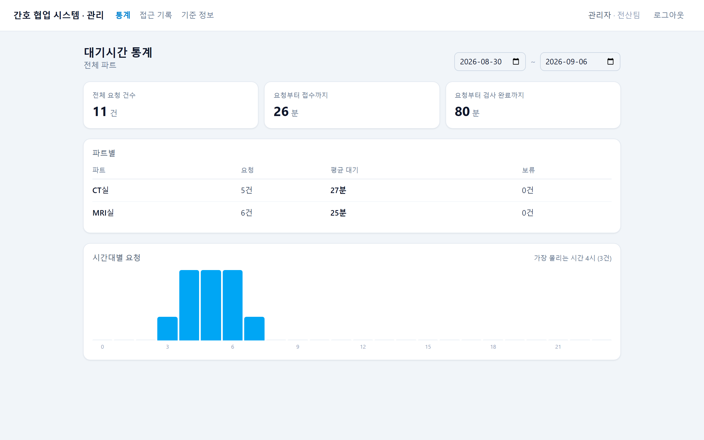
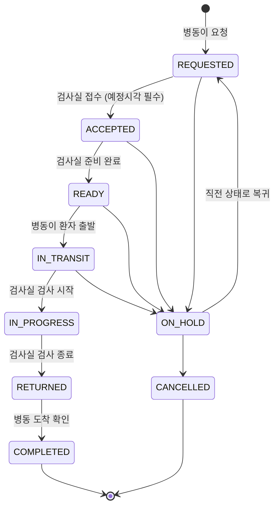

# nurse-collab

[](https://github.com/leebriller96/nurse-collab/actions/workflows/ci.yml)

**병동과 검사실 사이의 환자 이송을 전화 대신 시스템으로 처리하는 협업 도구.**

MRI·CT 검사를 위해 환자를 병동에서 검사실로 보내는 일은 지금도 대부분 전화로 이뤄진다.
언제 걸었는지, 누가 받았는지, 무엇을 주의하라고 말했는지는 아무 데도 남지 않는다.
이 프로젝트는 그 통화를 상태가 있는 요청으로 바꾸고, 오간 내용을 전부 기록으로 남긴다.

EMR 을 대체하지 않는다. **EMR 옆에 붙는 협업 레이어**로 만들었다.

> 포트폴리오 목적의 개인 프로젝트다.
> 환자·직원·병원 이름은 전부 가상이며 실제 의료 데이터는 들어 있지 않다.

---

## 화면

**검사실 — 앉아서 여러 건을 동시에 본다**

<p align="center">
  
  
</p>

**병동 — 한 손으로, 이동 중에, 짧게**

<p align="center">
  
  
  
</p>

가운데 화면이 이 시스템의 요점이다. 검사를 고르는 순간
**그 환자에게 확인이 필요한 항목이 자동으로 뜬다** — 전화로는 빠뜨리던 것들이다.

**관리자 — 어디가 막히는지 본다**

<p align="center">
  
</p>

같은 시스템이지만 쓰는 자리가 다르다. 반응형으로 같은 화면을 늘렸다 줄이는 대신
병동·검사실·관리자의 레이아웃을 아예 나눴다.

| 구분 | 화면 |
|---|---|
| 공통 | 로그인, 알림함 |
| 병동 (모바일 우선) | 환자 보드, 환자 상세, 요청 등록, 내 요청, 요청 상세, 활력징후, 간호기록 |
| 검사실 (PC 우선) | 들어온 요청, 일정 보드, 지난 요청, 요청 상세 |
| 관리자 | 대기시간 통계, 접근 기록, 기준 정보 관리 |

---

## 설계에서 신경 쓴 것

이 프로젝트에서 실제로 고민한 지점들이다. 기능 목록보다 이쪽이 핵심이다.

### 1. 상태 전이 규칙은 한 곳에만 있다

이송 요청은 9개 상태를 오간다. 전이할 수 있는 조합, 그 전이를 누를 수 있는 쪽,
사유나 예정시각이 필수인지가 전부 `TransferStatus.RULES` 테이블 하나에 들어 있다.

```java
new Rule(REQUESTED, ACCEPTED,  ActorSide.PERFORMER, false, true),   // 접수는 검사실이, 예정시각 필수
new Rule(READY,     IN_TRANSIT, ActorSide.REQUESTER, false, false), // 출발은 병동이
```

서비스나 컨트롤러에는 `if (status == ...)` 분기가 없다.
새 상태를 추가할 때 고칠 곳이 한 군데여야 하기 때문이다.
API 응답의 `availableTransitions` 도 이 표에서 그대로 나오므로,
화면의 버튼과 서버의 검증이 어긋날 수 없다.



보류는 규칙표에 넣지 않았다. 해제하면 "직전 상태"로 돌아가야 하는데
그 값이 고정이 아니라서, 저장해 둔 이전 상태를 보고 엔티티가 직접 처리한다.

### 2. 환자 정보 접근은 소속이 아니라 관계로 판단한다

"검사실 간호사니까 환자를 볼 수 있다" 는 틀렸다.
**나에게 온 요청에 걸린 환자만** 볼 수 있어야 하고, 요청이 끝나면 그 권한도 사라져야 한다.

```java
// 이 검사실이 관여하는 진행 중 요청이 있을 때만 열린다
transferRequestRepository.existsActiveByEncounterAndToDepartment(encounterId, deptId);
```

같은 이유로 조회 결과도 보는 사람에 따라 달라진다.
병동은 자기 환자 전체를 보고, 검사실은 요청에 걸린 환자만, 그것도 검사에 필요한 항목만 본다.

### 3. 두 사람이 동시에 눌러도 한 명만 성공한다

검사실 간호사 둘이 같은 요청을 동시에 접수하면 환자가 두 번 불려 간다.
요청에 `@Version` 을 걸고, 전이 요청에 클라이언트가 들고 있던 버전을 함께 받는다.
늦게 도착한 쪽은 `409 TR-002` 로 막힌다.

여기서 실제로 버그를 하나 만났다.
`@Version` 은 flush 시점에 올라가는데 그 전에 응답을 만들면 **증가하지 않은 버전이 나간다.**
클라이언트는 그 값으로 다음 요청을 보내고, 그래서 매번 409 를 맞는다.

```java
// 아직 올라가지 않은 버전이 응답에 실리면 클라이언트는 다음 요청마다 409 를 맞는다
requestRepository.flush();
return TransitionResponse.of(request, actor);
```

실시간 연동을 붙인 뒤로는 남이 먼저 처리하면 화면이 즉시 따라잡기 때문에,
"낡은 화면으로 눌러 보는" 방식으로는 이 충돌을 재현할 수 없다.
**실시간은 충돌을 줄이지만 없애지는 못한다** — 진짜 동시에 누르는 경우가 남는다.
그래서 시연 스크립트는 한쪽 요청을 잠시 붙잡아 두고 그사이 다른 사람이 커밋하게 만든다.

### 4. 알림은 반드시 커밋 이후에 나간다

트랜잭션 안에서 알림을 보내면, 그 뒤에 롤백이 났을 때
**일어나지 않은 일에 대한 알림**이 이미 나가 있다.

```java
@TransactionalEventListener(phase = AFTER_COMMIT)
@Transactional(propagation = REQUIRES_NEW)
```

반대로 알림 발송이 실패해도 이송 처리는 성공해야 하므로 트랜잭션을 새로 연다.

프론트는 받은 알림으로 화면을 그리지 않는다. **캐시를 무효화하고 REST 로 다시 받아온다.**
알림 메시지와 실제 데이터가 어긋나는 경우를 아예 없애기 위해서다.
폴링은 60초 보조 장치로만 남겼다.

### 5. 기록은 지우지 않는다

`transfer_event`, `nursing_note`, `audit_log` 에는 DELETE 가 없다. API 도 만들지 않았다.

- 간호기록은 **본인이 24시간 안에만** 고칠 수 있고, 고치기 전 내용은 감사 로그에 before/after 로 남는다
- 부서·직원·검사 종류도 삭제하지 않고 **사용 중지**만 한다. 지난 요청 이력이 그 이름을 참조하고 있기 때문이다
- 환자 정보를 열어본 것 자체도 `@Audited` + AOP 로 자동 적재된다

감사 로그 적재가 실패해도 조회는 성공한다. 기록을 남기지 못했다는 이유로
간호사가 환자 정보를 못 보게 되면 안 되기 때문이다.
대신 이 설계 때문에 **적재 실패가 조용히 넘어간다** — 개발 중에 이걸 눈치채는 데 세 번의 재기동이 걸렸다.

### 6. 화면에 개발자의 말을 쓰지 않는다

`ACCEPTED`, `IN_TRANSIT` 같은 상태 이름은 화면에 나오지 않는다.
버튼에는 다음에 할 일이 적혀 있다 — **접수 / 준비 완료 / 환자 출발 / 검사 시작 / 검사 종료 / 병동 도착**.
"낙관적 락 충돌" 대신 "다른 분이 먼저 처리했습니다" 라고 쓴다.

---

## 기술 스택

| 영역 | 스택 |
|---|---|
| 언어 · 프레임워크 | Java 21, Spring Boot 3.3 |
| 데이터 | PostgreSQL 16, Flyway, Spring Data JPA |
| 실시간 | Spring WebSocket + STOMP, Redis |
| 인증 | Spring Security + JWT (access 30분 / refresh 14일) |
| 프론트 | React 19, TypeScript, Vite, TanStack Query, Tailwind CSS 4 |
| 테스트 | JUnit 5, AssertJ, Testcontainers |
| 배포 | Docker, Docker Compose, nginx, GitHub Actions |

테이블 13개, Flyway 마이그레이션 6개, 백엔드 클래스 126개.

통합 테스트는 Testcontainers 로 **진짜 PostgreSQL** 을 띄운다.
JSONB 와 파티셔닝을 쓰기 때문에 H2 로는 검증이 되지 않는다.

---

## 실행

### 로컬 개발

DB 와 Redis 만 컨테이너로 띄우고, 애플리케이션은 호스트에서 돌린다.

```bash
docker compose up -d          # postgres, redis
./gradlew bootRun             # http://localhost:8080
```

```bash
cd frontend
npm install
npm run dev                   # http://localhost:5173
```

프론트는 Vite 프록시로 `/api` 와 `/ws` 를 백엔드에 넘긴다.
백엔드에 CORS 설정이 없고, 배포 구성과 모양이 같아진다.

스키마와 데모 데이터는 Flyway 가 기동할 때 넣는다. 따로 실행할 것이 없다.

### 배포

이미지 두 개(백엔드 JAR, nginx + 정적 파일)와 DB · Redis 를 한 번에 올린다.

```bash
cp .env.example .env          # POSTGRES_PASSWORD, JWT_SECRET 를 채운다
docker compose -f docker-compose.prod.yml up -d --build
```

밖으로 여는 포트는 웹 80 하나뿐이다. DB · Redis · 백엔드는 내부 네트워크에만 붙는다.
nginx 가 같은 오리진에서 화면과 `/api`, `/ws` 를 함께 내보내므로
프론트 코드 어디에도 서버 주소가 들어가지 않는다.

### 테스트

```bash
./gradlew test                # Docker 가 떠 있어야 한다 (Testcontainers)
```

---

## 데모 계정

비밀번호는 전부 `nurse1234!` 다. 전부 가상 인물이다.

| 아이디 | 역할 | 소속 | 로그인하면 |
|---|---|---|---|
| `ward01` | 간호사 | 3병동 | 환자 보드 |
| `ward02` | 간호사 | 5병동 | 환자 보드 |
| `head01` | 수간호사 | 3병동 | 환자 보드 + 통계 |
| `mri01` | 간호사 | MRI실 | 들어온 요청 |
| `ct01` | 간호사 | CT실 | 들어온 요청 |
| `admin01` | 관리자 | 전산팀 | 통계 · 접근 기록 · 기준 정보 |

로그인 화면에 계정 버튼이 있어 아이디를 칠 필요는 없다.

---

## 시연 시나리오

폰(병동)과 노트북(검사실)을 나란히 놓고 3분:

1. 폰에서 이송 요청 등록 → 노트북 큐에 즉시 표시
2. 검사실 상세에 "인공관절 — MRI 금기 가능성" 안내가 이미 떠 있음
3. 접수 처리 → 폰 화면이 실시간 갱신
4. 두 사람이 동시에 처리 시도 → 한 명은 "다른 분이 먼저 처리했습니다"
5. 관리자 화면에서 검사실별 평균 대기시간 확인

`e2e/rehearsal.mjs` 가 이 시나리오를 Playwright 로 자동 재생하며 자막과 함께 녹화한다.

```bash
cd e2e
npm install
node rehearsal.mjs            # recordings/ 에 webm 으로 저장된다
node screenshots.mjs          # README 용 스크린샷을 다시 뽑는다
```

---

## 프로젝트 구조

```
src/main/java/com/nursecollab/
├── domain/
│   ├── transfer/       이송 요청 — 상태 전이 규칙, 요청번호 발번, 메시지
│   ├── encounter/      재원 · 환자 조회 (보는 사람에 따라 결과가 달라진다)
│   ├── nursing/        활력징후, 간호기록(SBAR)
│   ├── notification/   알림함
│   ├── stats/          대기시간 집계 (SQL)
│   ├── audit/          접근 기록 조회
│   ├── master/         부서 · 직원 · 검사 종류 관리
│   ├── staff/          인증
│   ├── department/
│   └── patient/
└── global/
    ├── security/       JWT, STOMP 인증
    ├── audit/          @Audited + AOP 자동 적재
    ├── error/          에러 코드 체계
    └── config/

frontend/src/
├── features/           화면 단위
├── layouts/            병동 · 검사실 · 관리자 (레이아웃이 다르다)
└── shared/             api, hooks, ui
```

## 문서

설계를 먼저 쓰고 코드를 썼다. 코드와 어긋나면 문서를 먼저 고친다.

| 문서 | 내용 |
|---|---|
| [docs/01-db-schema.md](docs/01-db-schema.md) | 테이블 13개 DDL 과 설계 근거 |
| [docs/02-api-spec.md](docs/02-api-spec.md) | REST API 명세, 에러 코드 체계, WebSocket 규격 |
| [docs/03-backend-structure.md](docs/03-backend-structure.md) | 패키지 구조, 상태 전이 코드 |
| [docs/04-screens-permissions.md](docs/04-screens-permissions.md) | 화면 17개 정의, 권한 매트릭스 |

API 를 직접 눌러 보려면 Postman 컬렉션이 있다 —
[docs/nurse-collab.postman_collection.json](docs/nurse-collab.postman_collection.json).
로그인하면 토큰과 요청 ID 가 자동으로 변수에 담겨 다음 요청에 쓰인다.
